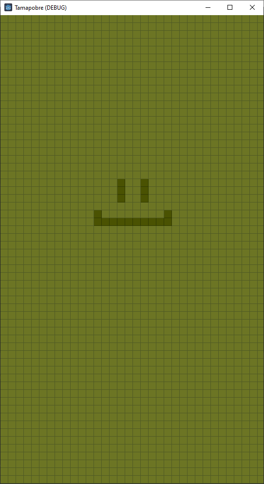

# Tamapobre - Game Design Document

## Sobre o Jogo

- **Gênero:** Tamagotchi-inspired.
- **Plataformas:** PC, mobile.
- **Público alvo:** Casuais.
- **Resumo do Jogo:** Jogo simples de Tamagotchi com visuais inspirados no Game Boy.
- **Motivação:** Consolidar meus estudos na Godot com um jogo simples.

## Mecânicas

- **Objetivos do Jogador:** Tomar conta do bichinho de estimação virtual, atendendo suas necessidades básicas.
- **Sistema de necessidades:** Fome, felicidade, higiene.
- **Ações do jogador:** Alimentar, brincar, dar banho.
- **Estados de falha:** Se negligenciado, o bichinho fica triste.

## Ambientação

- **Cenário:** Ambientação minimalista, inspirada no Game Boy antigo, com grid LCD e tela verde.

## Design de Personagem

- **Personagem Tama:** O tama tem design simples.
- **Progressão:** Por enquanto, sem evolução.

## Estilo Visual e Arte

- **Descrição do Estilo:** Pixel art minimalista, imitando a tela de um Game Boy.
- **Design de UI/UX:** Ainda indefinido.

## Som e Música

- **Estilo de Áudio:** Estilo retrõ com bips.
- **Efeitos Sonoros:** Sons para ações e minigames.

## Detalhes Técnicos

- **Engine:** Godot 4
- **Sistema de Salvamento:** Preciso conferir como farei para comparar a última vez aberta do aplicativo, para que ele tenha um estado salvo e comparação entre os atributos do
  personagem.

## Desenvolvimento Futuro

- **Roteiro:** Criando com assets básicos sem estilização e depois tentar dar polimento.
- **Ideias de Expansão:** Depois de pronto, não pretendo expandir muito este jogo, no máximo criar mais minigames.

## Referências

- **Inspirações:** Tamagotchi antigo e jogos de Game Boy.
- **Notas de Pesquisa:** Por enquanto nada.

## Plugins

- **Script-IDE:** Melhor organização de scripts, em abas.
